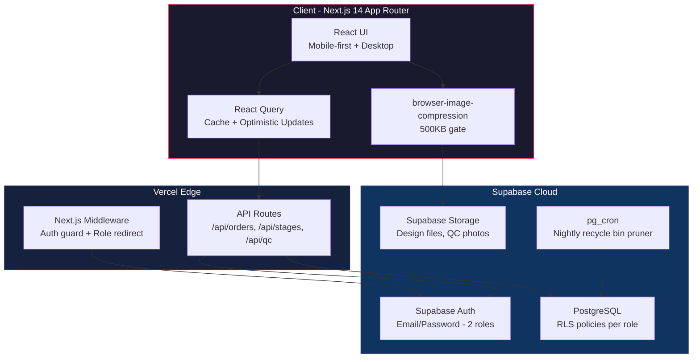
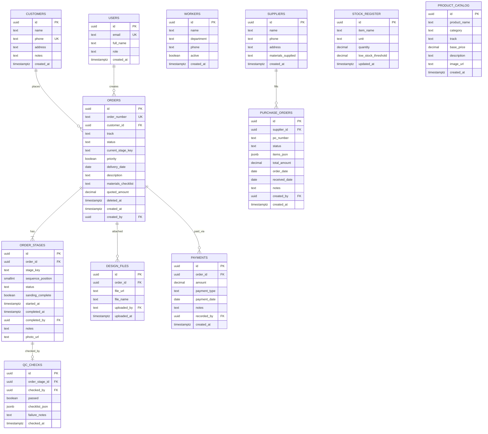
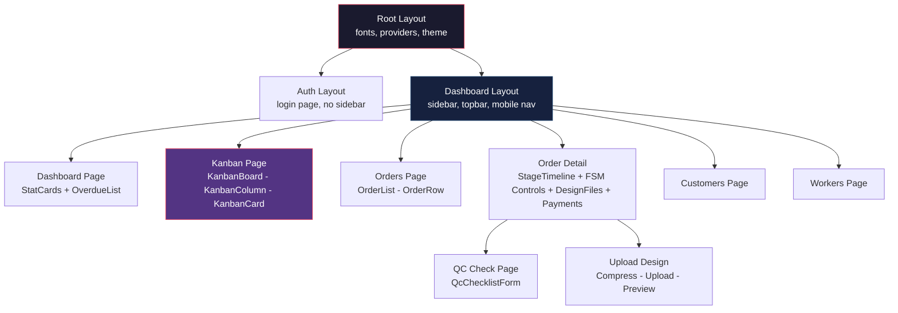
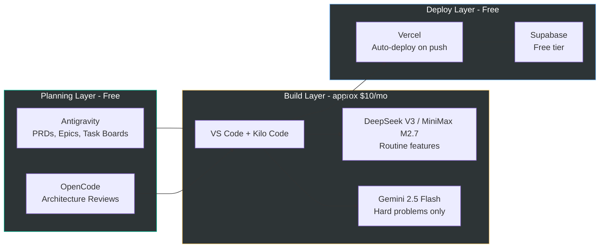

# FurnitureMFG — Technical Epic

**Technical Project Plan (TTP) + Technical Implementation Plan (TIP)**
**Version:** 1.0
**Date:** 30 March 2026
**Author:** Dhawal (via Antigravity planning session)
**Stack:** Next.js 14 · Supabase (Postgres + Auth + Storage + Edge Functions) · Vercel
**PRD Reference:** [PRD v2.0](file:///c:/Users/dhawa/.gemini/antigravity/scratch/furniture-mfg/docs/PRD.md) · [Project Decisions v1.0](file:///c:/Users/dhawa/Downloads/FurnitureMFG_ProjectDecisions_v1.0.md)

---

## Part A — Technical Project Plan (TTP)

### 1. Architecture Overview



> [!IMPORTANT]
> **Zero external APIs.** No Gupshup, no Twilio, no Cloudflare R2. The entire system runs on: Next.js - Supabase - Vercel. This is a hard constraint to protect the $18/month budget.

---

### 2. Architecture Decision Records (ADRs)

#### ADR-1: Next.js App Router (Not Pages Router)

| | |
|---|---|
| **Decision** | Use Next.js 14 App Router with Server Components |
| **Rationale** | App Router enables Server Components for the Kanban board (heavy data, rendered server-side), nested layouts for dashboard shell, and streaming for the production board. Pages Router is legacy. |
| **Trade-off** | Slightly steeper learning curve for the AI agent. Mitigated by explicit file-structure conventions in Memory Bank. |

#### ADR-2: Supabase Auth with Custom Claims for RBAC

| | |
|---|---|
| **Decision** | Store role in `users.role` column + mirror it into Supabase JWT custom claims via a Postgres function |
| **Rationale** | RLS policies can read `auth.jwt() -> 'role'` directly without an extra DB lookup on every request. Two roles only: `admin`, `manager`. |
| **Implementation** | A Postgres trigger `on_auth_user_created` inserts a row into `public.users` with a default `manager` role. A `set_claim()` function sets the role into `raw_app_meta_data`. |

#### ADR-3: FSM in Application Code, Not Database Triggers

| | |
|---|---|
| **Decision** | Stage transitions are handled by `advanceStage()` and `sendBackToStage()` TypeScript functions inside Next.js API routes — NOT Postgres triggers |
| **Rationale** | Business logic in triggers is invisible, hard to test, and impossible to step-through debug. The $2-5/month Gemini Flash budget is for debugging hard problems — keeping logic in TypeScript makes Gemini's job tractable. |
| **Guard rails** | RLS policies act as a secondary safety net. Direct `UPDATE` to `order_stages.status` from the client is blocked by RLS. |

#### ADR-4: React Query for Client State (Not Redux/Zustand)

| | |
|---|---|
| **Decision** | Use TanStack React Query v5 for all server-state management |
| **Rationale** | Eliminates the need for a global state library entirely. React Query handles caching, background refetch, and optimistic updates. The only client-only state is UI state (modal open, sidebar toggle) — handled by `useState`. |
| **Offline story** | React Query's `staleTime` + `gcTime` configuration provides basic offline reads. No IndexedDB sync layer. |

#### ADR-5: Image Compression is a Client-Side Gate

| | |
|---|---|
| **Decision** | All image uploads pass through `browser-image-compression` before reaching Supabase Storage |
| **Rationale** | Supabase free tier has storage limits. A 5MB phone photo uploaded 30 times/month = 150MB/month. Compressing to under 500KB / max 1920px width brings this to around 15MB/month. |
| **Enforcement** | The upload utility function rejects any blob over 500KB post-compression and shows a toast error. |

#### ADR-6: Monorepo Structure — Flat, Not Turborepo

| | |
|---|---|
| **Decision** | Single Next.js project. No monorepo tooling. |
| **Rationale** | There is one deployable. Turborepo, Nx, or pnpm workspaces add zero value and increase AI agent confusion. Keep the file tree flat and predictable. |

---

### 3. Database Architecture

#### 3.1 Complete Schema Map (All Tables)



**Enum values reference:**

- `users.role`: `admin` or `manager`
- `orders.track`: `A` or `B`
- `orders.status`: `draft`, `confirmed`, `in_production`, `on_hold`, `cancelled`, `dispatched`
- `order_stages.stage_key`: `carpentry`, `frame_making`, `sanding`, `polish`, `upholstery`, `qc_check`, `dispatch`
- `order_stages.status`: `pending`, `in_progress`, `complete`, `failed`, `cancelled`
- `payments.payment_type`: `advance`, `partial`, `balance`
- `purchase_orders.status`: `draft`, `ordered`, `received`, `cancelled`
- `stock_register.unit`: `pcs`, `kg`, `sqft`, `sheets`

#### 3.2 RLS Policy Strategy

| Table | Admin | Manager |
|---|---|---|
| `users` | Full CRUD | Read own row only |
| `customers` | Full CRUD | Full CRUD |
| `orders` | Full CRUD + toggle `priority` + permanent delete | CRUD (no `priority` toggle, soft-delete only) |
| `order_stages` | Read only (mutations via API) | Read only (mutations via API) |
| `qc_checks` | Read/Write via API | Read/Write via API |
| `payments` | Full CRUD | Create + Read (no edit/delete) |
| `workers` | Full CRUD | Read only |

> [!WARNING]
> **`order_stages` and `qc_checks` must NOT have direct INSERT/UPDATE RLS grants.** All mutations flow through `advanceStage()`, `sendBackToStage()`, and `submitQcCheck()` API routes which use the Supabase service-role key. This is the FSM integrity constraint.

#### 3.3 Supabase Storage Buckets

| Bucket | Access | Max file size | Purpose |
|---|---|---|---|
| `design-files` | Authenticated (RLS by order ownership) | 500KB (post-compression) | Order design images |
| `qc-photos` | Authenticated (RLS by order ownership) | 500KB (post-compression) | QC gate proof photos |

---

### 4. Frontend Architecture

#### 4.1 Project File Structure

```
furniture-mfg/
├── app/                        # Next.js App Router
│   ├── (auth)/                 # Auth layout group
│   │   ├── login/page.tsx
│   │   └── layout.tsx
│   ├── (dashboard)/            # Authenticated layout group
│   │   ├── layout.tsx          # Shell: sidebar + topbar
│   │   ├── page.tsx            # Dashboard / Owner overview
│   │   ├── orders/
│   │   │   ├── page.tsx        # Order list
│   │   │   ├── new/page.tsx    # Create order form
│   │   │   └── [id]/
│   │   │       ├── page.tsx    # Order detail + FSM controls
│   │   │       └── qc/page.tsx # QC check form
│   │   ├── kanban/page.tsx     # Master production board
│   │   ├── customers/
│   │   │   ├── page.tsx
│   │   │   └── [id]/page.tsx
│   │   ├── workers/page.tsx
│   │   ├── suppliers/page.tsx       # Phase 2
│   │   ├── inventory/page.tsx       # Phase 2
│   │   ├── payments/page.tsx        # Phase 2
│   │   ├── catalog/page.tsx         # Phase 2
│   │   ├── reports/page.tsx         # Phase 3
│   │   └── settings/page.tsx
│   ├── api/
│   │   ├── orders/
│   │   │   ├── route.ts            # CRUD
│   │   │   └── [id]/
│   │   │       ├── advance/route.ts    # advanceStage()
│   │   │       ├── hold/route.ts       # toggleHold()
│   │   │       └── sendback/route.ts   # sendBackToStage()
│   │   ├── qc/route.ts                # submitQcCheck()
│   │   ├── upload/route.ts            # Presigned URL generator
│   │   └── export/route.ts            # CSV export
│   └── layout.tsx              # Root layout
├── components/
│   ├── ui/                     # Primitives (Button, Input, Card, Badge, Modal)
│   ├── kanban/                 # KanbanBoard, KanbanColumn, KanbanCard
│   ├── orders/                 # OrderForm, OrderDetail, StageTimeline
│   ├── qc/                     # QcChecklistForm, QcResultBadge
│   ├── dashboard/              # StatCard, OverdueList, RecentOrders
│   └── layout/                 # Sidebar, Topbar, MobileNav
├── lib/
│   ├── supabase/
│   │   ├── client.ts           # Browser Supabase client
│   │   ├── server.ts           # Server Supabase client (service role)
│   │   └── middleware.ts       # Auth session refresh
│   ├── fsm/
│   │   ├── tracks.ts           # TRACK_STAGES constant
│   │   ├── advance.ts          # advanceStage() logic
│   │   └── sendback.ts         # sendBackToStage() logic
│   ├── upload.ts               # Image compression + upload utility
│   ├── export.ts               # CSV generation
│   └── utils.ts                # Formatters, date helpers
├── hooks/
│   ├── useOrders.ts            # React Query hooks for orders
│   ├── useKanban.ts            # Kanban-specific queries
│   ├── useAuth.ts              # Auth context hook
│   └── useUpload.ts            # Upload with compression hook
├── types/
│   └── index.ts                # All TypeScript interfaces
├── supabase/
│   ├── migrations/             # SQL migration files
│   │   ├── 001_users.sql
│   │   ├── 002_customers.sql
│   │   ├── 003_orders_and_fsm.sql
│   │   ├── 004_qc_checks.sql
│   │   ├── 005_design_files.sql
│   │   ├── 006_workers.sql
│   │   ├── 007_rls_policies.sql
│   │   ├── 008_cron_recycle_bin.sql
│   │   └── 009_phase2_tables.sql
│   └── seed.sql                # Dev seed data
├── .clinerules                 # Kilo Code agent rules
├── memory-bank/                # Kilo Code Memory Bank
│   ├── projectContext.md
│   ├── activeContext.md
│   └── techContext.md
└── public/
```

#### 4.2 Component Architecture



#### 4.3 Key UI Patterns

| Pattern | Implementation |
|---|---|
| **Mobile-first responsive** | CSS Grid + Flexbox. Kanban columns stack vertically on mobile, horizontally on desktop. |
| **Kanban aging indicator** | `card.border-left: 4px solid red` if `now() - started_at > 2 days` on the active stage. Calculated at render time from `order_stages.started_at`. |
| **Optimistic stage advance** | React Query `onMutate` immediately moves the card in the Kanban UI. `onError` rolls back. Gives instant feedback on slow connections. |
| **Toast notifications** | Lightweight toast system for success/error feedback. No external toast library — custom Toast component. |
| **Form validation** | `react-hook-form` + `zod` for type-safe validation on all forms. |

---

### 5. Development Environment and Workflow

#### 5.1 Tool Stack Execution Plan



#### 5.2 Model Routing Rules (Agent Decision Tree)

```
START TASK
  |
  |-- Is it PRD / architecture / epic planning?
  |   \-- YES: Claude.ai (free) or Antigravity
  |
  |-- Is it DB schema, FSM logic, RBAC, RLS, or a bug after 2 failed attempts?
  |   \-- YES: Gemini 2.5 Flash ($0.10-0.30/task)
  |
  |-- Is it a routine UI page, component, hook, or CRUD endpoint?
  |   \-- YES: DeepSeek V3 (primary) or MiniMax M2.7 (fallback)
  |
  \-- Is it Phase 2-3 feature additions?
      \-- YES: MiniMax M2.7 (cheapest capable model)
```

#### 5.3 Kilo Code Memory Bank Structure

Three files live in `/memory-bank/` and are read by Kilo Code at the start of every session:

| File | Purpose | Updated |
|---|---|---|
| `projectContext.md` | Stack, architecture, FSM rules, file structure conventions | Rarely (only on architecture changes) |
| `activeContext.md` | Current sprint tasks, what was last built, what is next | Every session |
| `techContext.md` | Known gotchas, Supabase quirks, model routing reminders | As discovered |

#### 5.4 `.clinerules` (Locked)

```
## CONTEXT RULES
- Only read files directly relevant to the current task
- Never read more than 5 files in a single context load without asking
- Prefer targeted edits over full file rewrites

## TASK RULES
- Break any task touching >3 files into subtasks and confirm before proceeding
- After every file edit, summarise what changed and what is next
- If uncertain about a file's role, ask before reading it

## OUTPUT RULES
- Always output diffs or targeted replacements, not full file dumps
- After completing a feature, list files changed and suggest what to test
```

---

### 5.5 Transparent Audit Trail in GitHub

Every completed and verified task **must be committed and pushed immediately** after verification — never batched. This creates an immutable, timestamped development log inside the GitHub repository.

#### Commit Message Convention

```
<type>(<sprint>/<task-id>): <short description> [verified ✓]
```

**Types:** `feat` | `fix` | `db` | `style` | `chore` | `test`

#### Branch Strategy

```bash
git checkout -b dev          # one-time: all sprint work happens here

# After verifying each task:
git add <relevant files>
git commit -m "<type>(s<N>/<task-id>): <description> [verified ✓]"
git push origin dev

# After ALL tasks in a sprint are verified:
git tag sprint-N-complete && git push origin sprint-N-complete

# After full sprint QA, merge into main:
git checkout main
git merge dev --no-ff -m "merge(sprint-N): all tasks verified ✓"
git push origin main
```

#### Audit Rules

| Rule | Detail |
|---|---|
| **One commit per task** | Never batch more than one task in a single commit |
| **Push immediately** | No local-only accumulation — push right after verification |
| **Sprint tags** | Tag `sprint-N-complete` after each sprint's final pushed commit |
| **Verified suffix** | Every commit message ends with `[verified ✓]` to confirm acceptance |
| **Main branch is production** | `main` is only updated by a sprint merge — never commit directly |
| **Phase tags** | After Phase 1 complete, tag `phase-1-complete` on `main` |

> [!TIP]
> **Path Safety Rule — Read before running any `git add` command.**
> The git commands throughout this document use expected folder paths (e.g., `app/(auth)/`, `app/(dashboard)/`).
> AI agents sometimes name folders slightly differently (e.g., `app/auth/` instead of `app/(auth)/`).
> **Always run `git status` first** to see the exact paths that were actually created, then adjust the `git add` targets accordingly before committing.
> ```bash
> git status   # run this first — verify real folder names before git add
> ```

---

## Part B — Technical Implementation Plan (TIP)

### 6. Phase 1 — Core Production Ledger

**Duration:** Months 1-2 (target: 8 weeks)
**Goal:** Every order tracked. Every bottleneck visible. Zero verbal coordination.

#### Sprint 0 — Foundation (Week 1)

| # | Task | Files | Model | Est. |
|---|---|---|---|---|
| 0.1 | Scaffold Next.js 14 App Router project with TypeScript | entire project | DeepSeek V3 | 2h |
| 0.2 | Configure Supabase project (local dev via CLI) | `supabase/config.toml` | Manual | 1h |
| 0.3 | Write full SQL migrations 001-008 | `supabase/migrations/*` | Gemini Flash | 4h |
| 0.4 | Implement RLS policies for all Phase 1 tables | `007_rls_policies.sql` | Gemini Flash | 3h |
| 0.5 | Set up Supabase Auth + custom claims trigger | `001_users.sql`, `lib/supabase/*` | Gemini Flash | 2h |
| 0.6 | Build Supabase client/server utilities | `lib/supabase/client.ts`, `server.ts` | DeepSeek V3 | 1h |
| 0.7 | Create TypeScript type definitions | `types/index.ts` | DeepSeek V3 | 1h |
| 0.8 | Design system: colors, typography, component tokens in CSS | `app/globals.css` | DeepSeek V3 | 2h |
| 0.9 | Build UI primitives: Button, Input, Card, Badge, Modal, Toast | `components/ui/*` | DeepSeek V3 | 3h |
| 0.10 | Set up Memory Bank files for Kilo Code | `memory-bank/*` | Manual | 1h |
| 0.11 | Create dev seed data SQL | `supabase/seed.sql` | DeepSeek V3 | 1h |

**Sprint 0 Total: ~21 hours**

#### Sprint 0 — Acceptance Criteria

Before starting Sprint 1, ALL of the following must pass:

- [ ] `npm run dev` starts on `localhost:3000` with zero console or TypeScript errors
- [ ] `supabase start` runs; Studio is accessible at `localhost:54323`
- [ ] `supabase db push` applies migrations 001–008 with zero SQL errors; all tables visible in Studio table editor
- [ ] RLS gate: executing `UPDATE order_stages SET status = 'complete' WHERE id = '<id>'` from a manager-role JWT returns `permission denied`
- [ ] Auth trigger: new user signup auto-inserts row in `public.users`; `raw_app_meta_data.role` = `"manager"` visible in Studio Auth panel
- [ ] `tsc --noEmit` exits with 0 errors after type definitions are committed
- [ ] All UI primitives (Button, Input, Card, Badge, Modal, Toast) render without errors in browser at `localhost:3000`
- [ ] Kilo Code session opens and confirms Memory Bank context is loaded (all 3 files read)
- [ ] Dev seed data: `supabase db seed` populates customers, orders, and workers; rows visible in Studio

> [!CAUTION]
> **Proceed gate:** Do NOT start Sprint 1 until every box is checked. Auth and RLS failures here cascade into every downstream sprint.

#### Sprint 0 — GitHub Push Commands

```bash
# Task 0.1 — Scaffold
git add . && git commit -m "feat(s0/0.1): scaffold Next.js 14 App Router project with TypeScript [verified ✓]"
git push origin dev

# Tasks 0.2–0.4 — Supabase config, migrations, RLS
git add supabase/ && git commit -m "db(s0/0.2-0.4): Supabase config + migrations 001-008 + RLS policies [verified ✓]"
git push origin dev

# Tasks 0.5–0.6 — Auth claims trigger + Supabase clients
git add supabase/migrations/001_users.sql lib/supabase/ && git commit -m "feat(s0/0.5-0.6): Supabase Auth claims trigger + browser/server client utilities [verified ✓]"
git push origin dev

# Tasks 0.7–0.8 — TypeScript types + design system
git add types/ app/globals.css && git commit -m "chore(s0/0.7-0.8): TypeScript type definitions + design system tokens [verified ✓]"
git push origin dev

# Tasks 0.9–0.11 — UI primitives, Memory Bank, seed
git add components/ui/ memory-bank/ .clinerules supabase/seed.sql && git commit -m "feat(s0/0.9-0.11): UI primitives + Kilo Code Memory Bank + dev seed data [verified ✓]"
git push origin dev

# Sprint 0 milestone tag
git tag sprint-0-complete && git push origin sprint-0-complete
```

---

#### Sprint 1 — Auth + Layout Shell (Week 2)

| # | Task | Files | Model | Est. |
|---|---|---|---|---|
| 1.1 | Login page (email/password) | `app/(auth)/login/page.tsx` | DeepSeek V3 | 2h |
| 1.2 | Auth middleware (session refresh + route protection) | `middleware.ts`, `lib/supabase/middleware.ts` | Gemini Flash | 2h |
| 1.3 | Dashboard layout shell (sidebar, topbar, mobile nav) | `app/(dashboard)/layout.tsx`, `components/layout/*` | DeepSeek V3 | 4h |
| 1.4 | Role-based UI guards (hide admin-only actions from managers) | `hooks/useAuth.ts`, layout | DeepSeek V3 | 1h |

**Sprint 1 Total: ~9 hours**

#### Sprint 1 — Acceptance Criteria

- [ ] `/login` renders correctly; submitting valid email/password logs the user in and redirects to `/dashboard`
- [ ] Invalid credentials on `/login` show an error message (no silent failure)
- [ ] Navigating directly to `/dashboard` while unauthenticated redirects to `/login`
- [ ] Session persists on hard page refresh (middleware successfully refreshes Supabase token)
- [ ] Dashboard layout renders: sidebar, topbar, and mobile bottom nav are all visible and functional
- [ ] Admin account sees admin-only UI elements (e.g., priority toggle, permanent delete); manager account does NOT
- [ ] Mobile nav works correctly on 375px viewport

> [!CAUTION]
> **Proceed gate:** Do NOT start Sprint 2 until role-based routing and session persistence are confirmed for both `admin` and `manager` accounts.

#### Sprint 1 — GitHub Push Commands

```bash
# Task 1.1 — Login page
git add "app/(auth)/" && git commit -m "feat(s1/1.1): login page with email/password auth form [verified ✓]"
git push origin dev

# Task 1.2 — Auth middleware
git add middleware.ts lib/supabase/middleware.ts && git commit -m "feat(s1/1.2): Next.js middleware - session refresh + protected route redirect [verified ✓]"
git push origin dev

# Task 1.3 — Dashboard layout shell
git add "app/(dashboard)/layout.tsx" components/layout/ && git commit -m "feat(s1/1.3): dashboard layout shell - sidebar, topbar, mobile nav [verified ✓]"
git push origin dev

# Task 1.4 — Role-based UI guards
git add hooks/useAuth.ts && git commit -m "feat(s1/1.4): role-based UI guards hiding admin-only actions from managers [verified ✓]"
git push origin dev

# Sprint 1 milestone tag
git tag sprint-1-complete && git push origin sprint-1-complete
```

---

#### Sprint 2 — Customer and Order CRUD (Week 3)

| # | Task | Files | Model | Est. |
|---|---|---|---|---|
| 2.1 | Customer list page + search | `app/(dashboard)/customers/page.tsx` | DeepSeek V3 | 3h |
| 2.2 | Customer detail/edit page | `customers/[id]/page.tsx` | DeepSeek V3 | 2h |
| 2.3 | Order list page with filters (status, priority, customer) | `orders/page.tsx` | DeepSeek V3 | 3h |
| 2.4 | Create order form (customer select, track A/B, delivery date, description, materials checklist) | `orders/new/page.tsx`, `components/orders/OrderForm.tsx` | DeepSeek V3 | 4h |
| 2.5 | Order API routes (CRUD) | `api/orders/route.ts` | DeepSeek V3 | 2h |
| 2.6 | React Query hooks for orders + customers | `hooks/useOrders.ts`, `hooks/useCustomers.ts` | DeepSeek V3 | 2h |
| 2.7 | Sequential order number generator (ORD-001) | `lib/utils.ts`, `api/orders/route.ts` | DeepSeek V3 | 1h |

**Sprint 2 Total: ~17 hours**

#### Sprint 2 — Acceptance Criteria

- [ ] Customer list page loads; search input filters by name and phone in real time
- [ ] Customer detail/edit page saves changes; reload confirms persistence
- [ ] Order list page shows all orders; status, priority, and customer filters each work independently
- [ ] Create order form: required field validation fires on submit; a valid form saves the order to DB
- [ ] Order number auto-generates sequentially as `ORD-001`, `ORD-002`, etc. — no duplicates, no gaps
- [ ] React Query cache invalidates after create/update; list refreshes without full page reload
- [ ] `/api/orders` returns `201` on create, `400` on invalid payload, `403` on RLS violation
- [ ] Newly created order appears in the order list immediately after creation

> [!CAUTION]
> **Proceed gate:** Do NOT start Sprint 3 until an order can be created end-to-end and appears correctly in the order list with the right order number.

#### Sprint 2 — GitHub Push Commands

```bash
# Tasks 2.1–2.2 — Customer pages
git add "app/(dashboard)/customers/" && git commit -m "feat(s2/2.1-2.2): customer list with search + customer detail/edit page [verified ✓]"
git push origin dev

# Tasks 2.3–2.4 — Order list + create form
git add "app/(dashboard)/orders/" components/orders/OrderForm.tsx && git commit -m "feat(s2/2.3-2.4): order list with filters + create order form [verified ✓]"
git push origin dev

# Tasks 2.5–2.7 — API routes, hooks, order number
git add app/api/orders/ hooks/useOrders.ts hooks/useCustomers.ts lib/utils.ts && git commit -m "feat(s2/2.5-2.7): order CRUD API routes + React Query hooks + sequential order number [verified ✓]"
git push origin dev

# Sprint 2 milestone tag
git tag sprint-2-complete && git push origin sprint-2-complete
```

---

#### Sprint 3 — FSM Engine + Order Detail (Week 4)

> [!CAUTION]
> **This is the highest-risk sprint.** The FSM engine is the foundation of the entire system. Use Gemini 2.5 Flash for all FSM logic. Test exhaustively before moving on.

| # | Task | Files | Model | Est. |
|---|---|---|---|---|
| 3.1 | `TRACK_STAGES` constant + types | `lib/fsm/tracks.ts` | Gemini Flash | 1h |
| 3.2 | `advanceStage()` function with all guards (sanding check, QC gate, dispatch block) | `lib/fsm/advance.ts` | Gemini Flash | 4h |
| 3.3 | `sendBackToStage()` function (rework loop) | `lib/fsm/sendback.ts` | Gemini Flash | 3h |
| 3.4 | `confirmOrder()` — creates all `order_stages` rows for the selected track | `api/orders/[id]/confirm/route.ts` | Gemini Flash | 2h |
| 3.5 | `toggleHold()` function (on_hold to in_production) | `api/orders/[id]/hold/route.ts` | DeepSeek V3 | 1h |
| 3.6 | Order detail page with stage timeline visualization | `orders/[id]/page.tsx`, `components/orders/StageTimeline.tsx` | DeepSeek V3 | 4h |
| 3.7 | FSM action buttons on order detail (Advance, Hold, Send Back) | `components/orders/FsmControls.tsx` | DeepSeek V3 | 2h |
| 3.8 | Mid-flight cancellation logic | `api/orders/[id]/cancel/route.ts` | Gemini Flash | 1h |

**Sprint 3 Total: ~18 hours**

#### Sprint 3 — Acceptance Criteria

- [ ] `TRACK_STAGES` constant defines correct stage sequences for Track A and Track B
- [ ] `advanceStage()`: sanding sub-stage (`sanding_complete`) must be `true` before advancing past sanding; attempt without it returns a clear error
- [ ] `advanceStage()`: QC gate blocks advance to dispatch if no `qc_checks` row with `passed = true` exists
- [ ] `sendBackToStage()`: creates a new `order_stages` row for the target stage in `pending`; marks current stage as `failed`
- [ ] `confirmOrder()`: creates ALL correct `order_stages` rows for the selected track in a single transaction; order status moves to `in_production`
- [ ] `toggleHold()`: flips order status between `on_hold` and `in_production` correctly on each call
- [ ] Order detail page renders stage timeline showing all stages, their status, and timestamps
- [ ] FSM action buttons (Advance, Hold, Send Back) show correct API responses in UI; success shows toast, error rolls back
- [ ] Mid-flight cancellation: sets order status to `cancelled` and all `pending`/`in_progress` stages to `cancelled`
- [ ] **Critical RLS check:** `UPDATE order_stages SET status = 'complete'` from a browser client returns `permission denied` — only API routes succeed via service-role key

> [!CAUTION]
> **Proceed gate:** FSM is the core of the entire system. Do NOT start Sprint 4 until the full flow (confirm → advance through all stages → QC → dispatch) works end-to-end, **and** the RLS bypass test fails as expected.

#### Sprint 3 — GitHub Push Commands

```bash
# Tasks 3.1–3.3 — FSM engine
git add lib/fsm/ && git commit -m "feat(s3/3.1-3.3): FSM engine - TRACK_STAGES, advanceStage, sendBackToStage [verified ✓]"
git push origin dev

# Tasks 3.4–3.5 — Confirm + Hold API routes
git add "app/api/orders/[id]/" && git commit -m "feat(s3/3.4-3.5): confirmOrder and toggleHold API routes [verified ✓]"
git push origin dev

# Tasks 3.6–3.7 — Order detail page + FSM controls
git add "app/(dashboard)/orders/[id]/" components/orders/StageTimeline.tsx components/orders/FsmControls.tsx && git commit -m "feat(s3/3.6-3.7): order detail page + stage timeline + FSM action buttons [verified ✓]"
git push origin dev

# Task 3.8 — Cancellation
git add "app/api/orders/[id]/cancel/" && git commit -m "feat(s3/3.8): mid-flight order cancellation logic [verified ✓]"
git push origin dev

# Sprint 3 milestone tag
git tag sprint-3-complete && git push origin sprint-3-complete
```

---

#### Sprint 4 — Kanban Board (Week 5)

| # | Task | Files | Model | Est. |
|---|---|---|---|---|
| 4.1 | Kanban board layout (columns per stage, cards per order) | `kanban/page.tsx`, `components/kanban/KanbanBoard.tsx` | DeepSeek V3 | 4h |
| 4.2 | Kanban card component (order number, customer, delivery date, priority badge) | `components/kanban/KanbanCard.tsx` | DeepSeek V3 | 2h |
| 4.3 | Department filter dropdown | `components/kanban/DeptFilter.tsx` | DeepSeek V3 | 1h |
| 4.4 | Aging indicator logic (red border if stalled over 2 days) | `components/kanban/KanbanCard.tsx` | DeepSeek V3 | 1h |
| 4.5 | Optimistic stage advance via drag-or-click on Kanban | `hooks/useKanban.ts` | DeepSeek V3 | 3h |
| 4.6 | React Query Kanban data hook with real-time polling (30s) | `hooks/useKanban.ts` | DeepSeek V3 | 1h |

**Sprint 4 Total: ~12 hours**

#### Sprint 4 — Acceptance Criteria

- [ ] Kanban board renders all stage columns; each order card appears in the column matching its `current_stage_key`
- [ ] Kanban card displays: order number, customer name, delivery date, and priority badge
- [ ] Department filter dropdown correctly shows/hides columns for non-selected departments
- [ ] Aging indicator: order `started_at` more than 2 days ago shows a red left border; under 2 days shows no border
- [ ] Stage advance via click triggers optimistic UI update (card moves immediately); if API call fails, card reverts to original column
- [ ] Kanban data polling: Network tab confirms a new request fires every 30 seconds
- [ ] Board is usable on 375px mobile viewport — columns scroll horizontally without breaking layout

> [!CAUTION]
> **Proceed gate:** Do NOT start Sprint 5 until live DB state is accurately reflected within 30 seconds and the aging indicator is visually verified.

#### Sprint 4 — GitHub Push Commands

```bash
# Tasks 4.1–4.2 — Board + card
git add "app/(dashboard)/kanban/" components/kanban/KanbanBoard.tsx components/kanban/KanbanCard.tsx && git commit -m "feat(s4/4.1-4.2): Kanban board layout + order card component [verified ✓]"
git push origin dev

# Tasks 4.3–4.4 — Filter + aging indicator
git add components/kanban/DeptFilter.tsx && git commit -m "feat(s4/4.3-4.4): department filter dropdown + red aging indicator for stalled orders [verified ✓]"
git push origin dev

# Tasks 4.5–4.6 — Optimistic updates + polling
git add hooks/useKanban.ts && git commit -m "feat(s4/4.5-4.6): optimistic stage advance + 30-second React Query polling [verified ✓]"
git push origin dev

# Sprint 4 milestone tag
git tag sprint-4-complete && git push origin sprint-4-complete
```

---

#### Sprint 5 — QC, Design Uploads, Workers (Week 6)

| # | Task | Files | Model | Est. |
|---|---|---|---|---|
| 5.1 | QC checklist form (dynamic items, pass/fail, failure notes) | `orders/[id]/qc/page.tsx`, `components/qc/QcChecklistForm.tsx` | DeepSeek V3 | 3h |
| 5.2 | QC API route (`submitQcCheck()`) | `api/qc/route.ts` | Gemini Flash | 2h |
| 5.3 | QC result badge on order detail + Kanban card | `components/qc/QcResultBadge.tsx` | DeepSeek V3 | 1h |
| 5.4 | Image compression utility (`browser-image-compression`) | `lib/upload.ts`, `hooks/useUpload.ts` | DeepSeek V3 | 2h |
| 5.5 | Design file upload UI on order detail | `components/orders/DesignFileUpload.tsx` | DeepSeek V3 | 2h |
| 5.6 | QC mandatory photo upload at QC gate | `components/qc/QcPhotoUpload.tsx` | DeepSeek V3 | 1h |
| 5.7 | Worker directory page (list + add/edit) | `workers/page.tsx` | DeepSeek V3 | 2h |
| 5.8 | Simple attendance grid (date x worker matrix) | `workers/attendance/page.tsx` | DeepSeek V3 | 3h |

**Sprint 5 Total: ~16 hours**

#### Sprint 5 — Acceptance Criteria

- [ ] QC checklist form renders items dynamically; pass/fail toggle works per item; failure notes field appears (and is required) when any item fails
- [ ] QC form submission creates a `qc_checks` row via `/api/qc`; verify NO direct-client insert is possible (RLS blocks it)
- [ ] QC result badge appears on order detail and Kanban card: shows `Passed` (green) or `Failed` (red)
- [ ] Image upload: a test image > 500KB is compressed below 500KB before upload; a file that cannot compress below 500KB shows a toast error and is rejected
- [ ] Design files appear in the order detail after upload; clicking the file opens it in a new tab
- [ ] QC gate confirmed: attempting to advance an order past `qc_check` stage without a `passed = true` QC record returns an error
- [ ] QC photo upload is mandatory: submitting the QC form without a photo attachment returns a validation error
- [ ] Worker directory: add and edit a worker; changes persist on reload; active/inactive toggle updates the record
- [ ] Attendance grid: selecting a date and marking attendance saves records; data persists on reload

> [!CAUTION]
> **Proceed gate:** Do NOT start Sprint 6 until the QC dispatch block and the 500KB compression gate are both manually verified.

#### Sprint 5 — GitHub Push Commands

```bash
# Tasks 5.1–5.3 — QC form, API route, result badge
git add "app/(dashboard)/orders/[id]/qc/" components/qc/ app/api/qc/ && git commit -m "feat(s5/5.1-5.3): QC checklist form + submitQcCheck API + result badge [verified ✓]"
git push origin dev

# Tasks 5.4–5.6 — Image upload, design files, QC photo
git add lib/upload.ts hooks/useUpload.ts components/orders/DesignFileUpload.tsx components/qc/QcPhotoUpload.tsx && git commit -m "feat(s5/5.4-5.6): 500KB image compression gate + design file upload + mandatory QC photo [verified ✓]"
git push origin dev

# Tasks 5.7–5.8 — Workers + attendance
git add "app/(dashboard)/workers/" && git commit -m "feat(s5/5.7-5.8): worker directory + attendance grid [verified ✓]"
git push origin dev

# Sprint 5 milestone tag
git tag sprint-5-complete && git push origin sprint-5-complete
```

---

#### Sprint 6 — Dashboard, Export, Priority, Recycle Bin (Week 7)

| # | Task | Files | Model | Est. |
|---|---|---|---|---|
| 6.1 | Owner dashboard — stat cards (active orders, overdue, outstanding payments) | `app/(dashboard)/page.tsx`, `components/dashboard/*` | DeepSeek V3 | 3h |
| 6.2 | Overdue orders list widget | `components/dashboard/OverdueList.tsx` | DeepSeek V3 | 1h |
| 6.3 | Recent orders widget | `components/dashboard/RecentOrders.tsx` | DeepSeek V3 | 1h |
| 6.4 | Priority toggle (admin-only, visual badge) | `components/orders/PriorityToggle.tsx` | DeepSeek V3 | 1h |
| 6.5 | CSV export (orders, payments, customers) | `api/export/route.ts`, `lib/export.ts` | DeepSeek V3 | 2h |
| 6.6 | Soft delete + Recycle Bin page | `orders/recycle-bin/page.tsx` | DeepSeek V3 | 2h |
| 6.7 | `pg_cron` nightly pruner (delete orders older than 30 days in recycle bin) | `supabase/migrations/008_cron_recycle_bin.sql` | Gemini Flash | 1h |
| 6.8 | Settings page (user profile, password change) | `settings/page.tsx` | DeepSeek V3 | 1h |

**Sprint 6 Total: ~12 hours**

#### Sprint 6 — Acceptance Criteria

- [ ] Dashboard stat cards show accurate counts from DB: total active orders, overdue orders (past delivery date), outstanding payment balance
- [ ] Overdue orders list widget shows correct orders sorted by delivery date (oldest first)
- [ ] Recent orders widget shows the 5 most recent orders with correct status badges
- [ ] Priority toggle: admin clicks toggle and priority flag updates; manager role sees no toggle button at all
- [ ] CSV export: download a `.csv` file for orders, payments, and customers; verify headers and row data are correct
- [ ] CSV role check: manager export does NOT include admin-only fields (no data leakage)
- [ ] Soft delete: deleting an order removes it from the active order list and moves it to the Recycle Bin
- [ ] Recycle Bin: admin can restore a soft-deleted order (it reappears in the active list); admin can permanently delete (row is gone from DB)
- [ ] `pg_cron` job is registered: query `SELECT * FROM cron.job;` in Supabase Studio confirms the nightly pruner job exists
- [ ] Settings page: profile changes save and persist; password change works without errors

> [!CAUTION]
> **Proceed gate:** Do NOT start Sprint 7 until dashboard numbers match the DB record counts exactly and CSV export is verified clean of role leakage.

#### Sprint 6 — GitHub Push Commands

```bash
# Tasks 6.1–6.3 — Dashboard
git add "app/(dashboard)/page.tsx" components/dashboard/ && git commit -m "feat(s6/6.1-6.3): owner dashboard - stat cards, overdue list, recent orders [verified ✓]"
git push origin dev

# Task 6.4 — Priority toggle
git add components/orders/PriorityToggle.tsx && git commit -m "feat(s6/6.4): admin-only priority toggle with visual badge [verified ✓]"
git push origin dev

# Task 6.5 — CSV export
git add app/api/export/ lib/export.ts && git commit -m "feat(s6/6.5): CSV export for orders, payments, customers [verified ✓]"
git push origin dev

# Tasks 6.6–6.7 — Recycle bin + pg_cron
git add "app/(dashboard)/orders/recycle-bin/" supabase/migrations/008_cron_recycle_bin.sql && git commit -m "feat(s6/6.6-6.7): soft delete + recycle bin page + pg_cron nightly pruner [verified ✓]"
git push origin dev

# Task 6.8 — Settings
git add "app/(dashboard)/settings/" && git commit -m "feat(s6/6.8): settings page - profile and password change [verified ✓]"
git push origin dev

# Sprint 6 milestone tag
git tag sprint-6-complete && git push origin sprint-6-complete
```

---

#### Sprint 7 — Testing, Polish, Deploy (Week 8)

| # | Task | Files | Model | Est. |
|---|---|---|---|---|
| 7.1 | End-to-end FSM flow testing (happy path + rework + cancellation + hold) | Manual + test script | Gemini Flash | 4h |
| 7.2 | RLS policy verification (attempt forbidden actions from manager role) | Manual | Gemini Flash | 2h |
| 7.3 | Mobile responsive audit (all pages on 375px viewport) | Manual | — | 2h |
| 7.4 | Performance audit (Lighthouse, bundle size check) | `next.config.js` optimizations | DeepSeek V3 | 1h |
| 7.5 | Vercel production deployment + Supabase production project setup | Manual | — | 2h |
| 7.6 | Create second user account (manager role) for factory testing | Manual | — | 0.5h |
| 7.7 | Write user guide for factory managers | `docs/user-guide.md` | DeepSeek V3 | 2h |

**Sprint 7 Total: ~13.5 hours**

#### Sprint 7 — Acceptance Criteria

- [ ] FSM happy path: `draft → confirmed → in_production → [all track stages] → dispatched` completes end-to-end on production
- [ ] FSM rework path: `sendBackToStage()` creates a new retry stage row; order correctly reappears in the earlier Kanban column
- [ ] FSM cancellation: cancel mid-flight sets order and all open stages to `cancelled`; Kanban card is removed
- [ ] FSM hold/resume: `toggleHold()` pauses and resumes an order; Kanban properly reflects the `on_hold` status
- [ ] RLS verification: manager-role JWT cannot directly write to `order_stages`, `qc_checks`, or toggle `priority` — all return `permission denied`
- [ ] All 14 pages pass mobile audit at 375px viewport: no horizontal scroll overflow, no broken layouts, no overlapping elements
- [ ] Lighthouse scores on key pages: **Performance ≥ 80**, **Accessibility ≥ 90**
- [ ] Production deployment: app is live on Vercel; all env vars (`NEXT_PUBLIC_SUPABASE_URL`, `SUPABASE_SERVICE_ROLE_KEY`, etc.) are set in Vercel dashboard
- [ ] Second user (manager role) logs in on **production** and can complete the full order workflow
- [ ] User guide published to `docs/user-guide.md` and accessible to factory managers
- [ ] All items in the Definition of Done checklist (§12) are verified on **production**, not just local dev

> [!CAUTION]
> **Phase 1 Gate:** Do NOT mark Phase 1 complete or begin Phase 2 planning until every DoD item in §12 is checked off against the live Vercel production URL.

#### Sprint 7 — GitHub Push Commands

```bash
# Tasks 7.1–7.2 — FSM + RLS test evidence
mkdir -p docs/test-results
# Save manual test results to docs/test-results/sprint7-fsm-rls.md
git add docs/test-results/ && git commit -m "test(s7/7.1-7.2): FSM full flow + RLS bypass verification results [verified ✓]"
git push origin dev

# Task 7.3 — Mobile responsive fixes
git add app/ components/ && git commit -m "style(s7/7.3): mobile responsive fixes from 375px viewport audit [verified ✓]"
git push origin dev

# Task 7.4 — Performance optimizations
git add next.config.js && git commit -m "chore(s7/7.4): Lighthouse performance optimizations - bundle size + image config [verified ✓]"
git push origin dev

# Tasks 7.6–7.7 — Factory user + user guide
git add docs/user-guide.md && git commit -m "docs(s7/7.6-7.7): user guide for factory managers [verified ✓]"
git push origin dev

# Sprint 7 milestone tag
git tag sprint-7-complete && git push origin sprint-7-complete

# --- PHASE 1 COMPLETE ---
# Merge dev into main (production branch)
git checkout main
git merge dev --no-ff -m "merge(phase-1): Phase 1 complete - all sprints 0-7 verified ✓"
git push origin main

# Tag Phase 1 milestone
git tag phase-1-complete && git push origin phase-1-complete

# Task 7.5 — Vercel production deployment is triggered automatically by the push to main
# Verify: check Vercel dashboard for successful deployment status
```

---

### 7. Phase 1 Summary

| Metric | Value |
|---|---|
| **Total estimated hours** | ~118.5 hours |
| **Calendar weeks** | 8 (part-time, alongside factory operations) |
| **Pages/routes** | 14 |
| **API endpoints** | 10 |
| **DB tables** | 8 (Phase 1) |
| **Gemini Flash tasks** | ~15 (high-value tasks only) |
| **DeepSeek V3 tasks** | ~40 (routine build) |
| **Estimated OpenRouter cost** | $10-14 for Phase 1 |

---

### 8. Phase 2 — Inventory and Financial Basics (Preview)

**Duration:** Months 3-4
**Prerequisite:** Phase 1 deployed and used in factory for 2+ weeks

| Epic | Key Tasks | Model |
|---|---|---|
| **Payment Tracking** | Payments table, payment form on order detail, payment history, outstanding balance calculation | MiniMax M2.7 |
| **Supplier Directory** | Supplier CRUD, phone/address, materials supplied | MiniMax M2.7 |
| **Purchase Orders** | PO form, PO list, status tracking (draft to ordered to received) | MiniMax M2.7 |
| **Stock Register** | Manual stock ledger, low-stock visual indicator, simple add/subtract UI | MiniMax M2.7 |
| **Product Catalog** | Product templates page, base price, category, link to order creation | MiniMax M2.7 |
| **Dashboard v2** | Add financial widgets (total outstanding, recent payments) to owner dashboard | DeepSeek V3 |

**Estimated effort:** ~50-60 hours

---

### 9. Phase 3 — Analytics and Quality (Preview)

**Duration:** Months 5-6
**Prerequisite:** Phase 2 complete, 3+ months of production data

| Epic | Key Tasks | Model |
|---|---|---|
| **3 Core Reports** | On-time delivery %, average stage duration chart, outstanding payments summary | MiniMax M2.7 |
| **Rework Tracking** | Rework count per order, rework reason log, link to `sendBackToStage` history | MiniMax M2.7 |
| **Dispatch Log** | Text fields at dispatch stage (driver name, vehicle, dispatch notes) | MiniMax M2.7 |
| **Complaint Log** | Simple text log on completed order page, complaint date, resolution notes | MiniMax M2.7 |
| **Dashboard v3** | Add analytics widgets (on-time %, bottleneck stage highlight) | DeepSeek V3 |

**Estimated effort:** ~35-45 hours

---

### 10. Risk Register

| Risk | Impact | Likelihood | Mitigation |
|---|---|---|---|
| Supabase free tier storage limits exceeded | Medium | Low | Client-side compression to under 500KB enforced. Monitor monthly usage. |
| OpenRouter budget overrun | High | Medium | Hard $18/month cap. Route routine tasks to cheapest model. Track daily spend. |
| FSM bugs cause data corruption | Critical | Medium | All FSM mutations go through tested API functions. RLS blocks direct writes. Gemini Flash for debugging. |
| Manager adoption resistance | High | Low | Keep UI dead simple. Physical job card IDs match digital. No training required for floor workers. |
| Vercel cold starts on API routes | Low | Medium | Keep API routes lightweight. Use edge runtime where possible. |
| Kilo Code agent generates incorrect code | Medium | High | `.clinerules` enforce targeted edits. Memory Bank provides context. Review all generated code before commit. |

---

### 11. Budget Projection

| Month | Tool | Projected Spend |
|---|---|---|
| Month 1 | OpenRouter (DeepSeek V3 + Gemini Flash) | $8-12 |
| Month 2 | OpenRouter (mostly DeepSeek V3, less Flash) | $6-10 |
| Month 3 | OpenRouter (MiniMax M2.7 primary) | $4-8 |
| Month 4 | OpenRouter (MiniMax M2.7 primary) | $4-8 |
| Month 5-6 | OpenRouter (MiniMax M2.7 primary) | $3-6/month |
| **Total 6 months** | | **$29-50** |

All free-tier services:
- Vercel Hobby (free)
- Supabase Free Tier (500MB DB, 1GB Storage, 50K monthly active users)
- Antigravity (free)
- Kilo Code extension (free, uses OpenRouter key)

---

### 12. Definition of Done — Phase 1

Phase 1 is **DONE** when all of the following are true:

- [ ] A manager can create a customer, create an order, and confirm it (generating all stage rows)
- [ ] The order appears on the Kanban board in the correct track column
- [ ] A manager can advance stages one-by-one, with sanding sub-stage enforced
- [ ] QC check form works, QC gate blocks dispatch if not passed
- [ ] Orders stalled over 2 days show red aging indicator on Kanban
- [ ] Design files can be uploaded (compressed) and viewed on the order
- [ ] QC photo upload is mandatory at the QC gate
- [ ] Admin can toggle priority; Manager cannot
- [ ] Soft delete moves orders to Recycle Bin; Admin can restore or permanently delete
- [ ] Owner dashboard shows active orders, overdue count, and outstanding payments
- [ ] CSV export works for orders and customers
- [ ] App is responsive on mobile (375px) and desktop (1440px)
- [ ] RLS policies prevent unauthorized access (verified by manual test)
- [ ] Production deployment on Vercel is live and accessible

---

*End of Technical Epic — FurnitureMFG TTP + TIP v1.0*
*Next step: Approve this plan then Create Kilo Code Memory Bank files then Begin Sprint 0*
